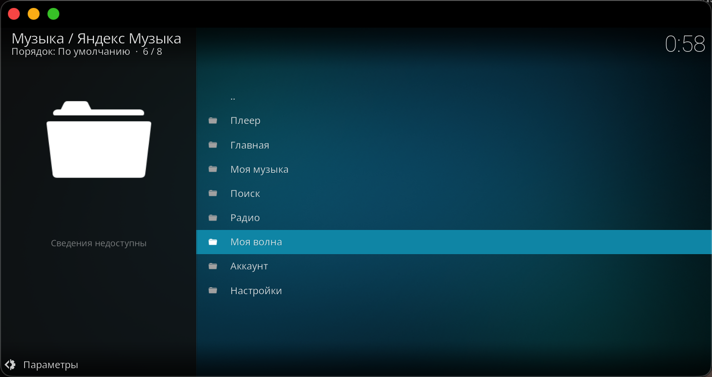
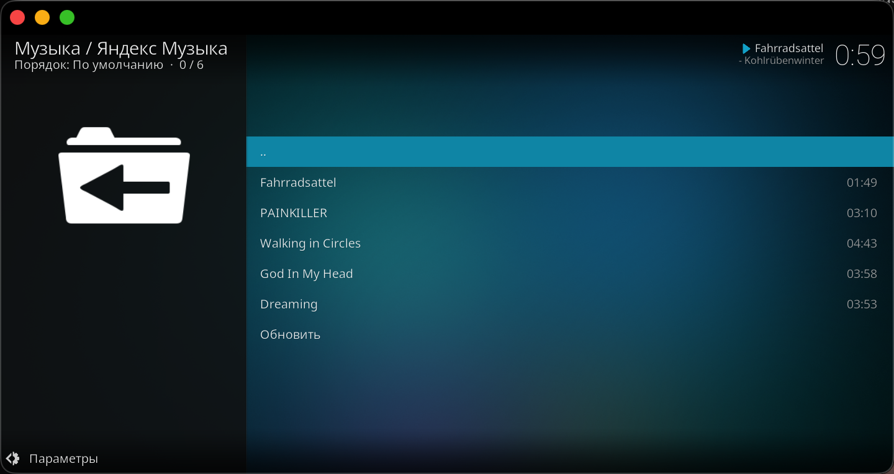
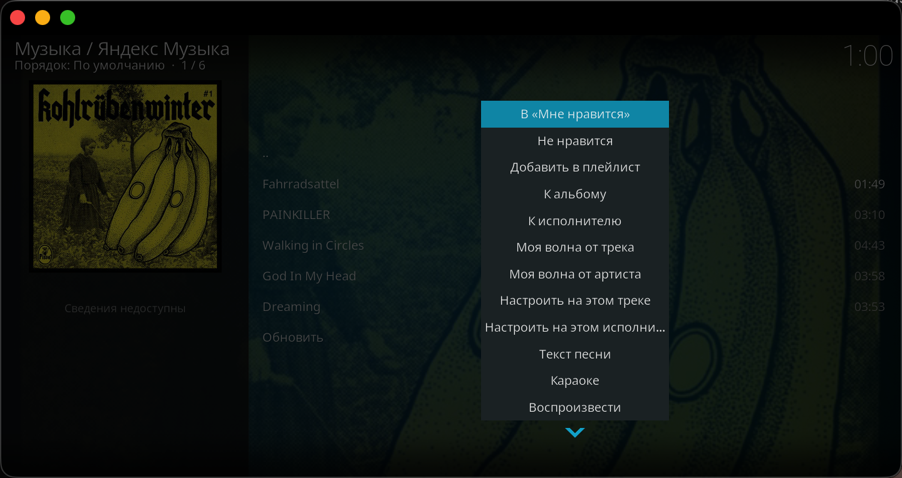
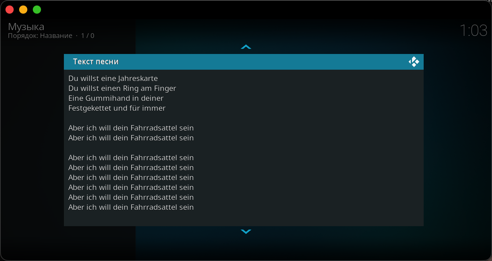
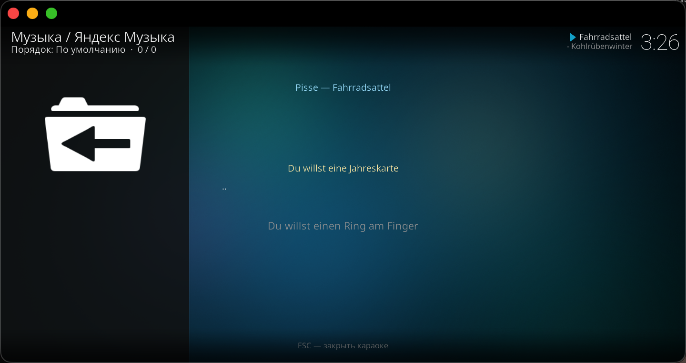
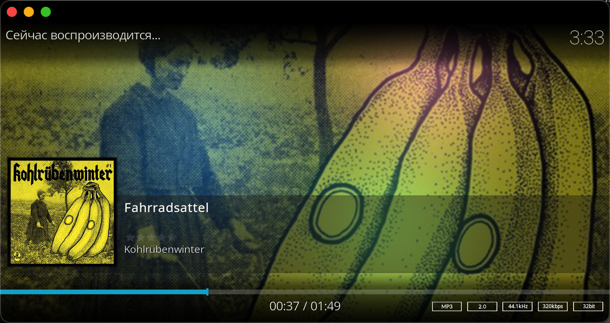

# Яндекс Музыка для Kodi

Неофициальный плагин **Яндекс Музыка** для Kodi (19/20/21+, Python 3). Вход по коду устройства, «Моя волна», поиск, чарты, радио, текст песни и караоке.

> Неофициальный плагин. Использует неофициальный API Яндекс Музыки. Для полноценного прослушивания нужна подписка Яндекс Плюс (без неё доступны короткие превью).

## Установка

### Способ 1 — репозиторий (рекомендуется, автообновления)

1. Скачайте `repository.tsifrokayf-1.0.0.zip` с [Releases](https://github.com/Tsifrokayf/kodi-yandexmusic/releases/latest) (или из папки `repository.tsifrokayf/` репозитория).
2. В Kodi: **Настройки → Дополнения → Установить из zip-файла** → выберите скачанный zip.
3. **Настройки → Дополнения → Установить из репозитория → Tsifrokayf Repository → Аудиодополнения → Яндекс Музыка → Установить**.
4. Готово. При выходе новой версии Kodi сам покажет уведомление «Доступно обновление плагина» — подтвердите установку в **Дополнения → Установленные → Яндекс Музыка → Обновления**.

### Способ 2 — вручную из zip

1. Скачайте `plugin.audio.yandexmusic-<версия>.zip` с [Releases](https://github.com/Tsifrokayf/kodi-yandexmusic/releases/latest).
2. **Настройки → Дополнения → Установить из zip-файла** → выберите zip.

> После обновления перезапустите Kodi, чтобы изменения вступили в силу.

## Вход

1. Откройте плагин → **Аккаунт → Войти** (или **Параметры → Войти по коду устройства**).
2. На экране появится код и адрес `https://mobile.yandex.ru/autorization` — откройте его на телефоне/компьютере, введите код и подтвердите вход в своём аккаунте Яндекс.

Также можно вручную указать OAuth-токен в настройках (**Основные → OAuth-токен (вручную)**).

## Функции

### Главное меню

Плеер, Главная, Моя музыка, Поиск, Радио, Моя волна, Аккаунт, Настройки.

### «Моя волна»

Автоматическая персональная радиостанция с управлением лайками:

- запуск из главного меню;
- **Моя волна от трека / от артиста** — в контекстном меню любого трека: волна «по похожим»;
- лайк/дизлайк текущего трека волны прямо из меню (**В «Мне нравится» / Не нравится**);
- **Настроить на этом треке / исполнителе** — точечная настройка станции.

### Контекстное меню трека

Лайк, дизлайк, добавление в плейлист, к альбому и исполнителю, волна от трека/артиста, **Текст песни**, **Караоке**, воспроизведение.

### Текст песни

Полный текст трека в стандартном окне просмотра текста Kodi.

### Караоке

Оверлей поверх плеера: заголовок, текущая строка крупно, следующая строка и подсказка. Текст листается синхронно с треком (LRC), закрывается по ESC или по окончанию трека.

### Плеер

Фоновая обложка, время, битрейт; кэширование треков в фоне (повторы играют мгновенно).

### Прочее

- **Поиск** треков, альбомов, исполнителей; **Главная**, **чарты**, **новинки**.
- **Радио**: станции и «настроить на треке/исполнителе».
- **Плейлисты**: просмотр, добавление треков, «Мне нравится».
- **Качество звука**: MP3 / AAC / **FLAC (без потерь)** — по умолчанию FLAC.
- **Кэш**: офлайн-повторы, настраиваемое время жизни кэша.
- **Автообновления** из репозитория + уведомление о новой версии.

## Настройки

| Параметр | Описание |
| --- | --- |
| Предпочитаемый кодек | MP3 / AAC / FLAC (по умолчанию FLAC) |
| Кэшировать треки в фоне | Трек качается в кэш параллельно с воспроизведением |
| Время кэша (минуты) | Срок хранения данных главной, чарта и поиска |
| OAuth-токен (вручную) | Альтернатива входу по коду устройства |

## Разработка

- Исходники: `plugin.audio.yandexmusic/`
- Тесты: `python3 -m unittest discover -s tests` (в каталоге плагина)
- Сборка zip с авто-бампом версии и публикацией в `docs/`: `sh build_zip.sh`
- GitHub Pages публикует `docs/` как `https://tsifrokayf.github.io/kodi-yandexmusic/`

## Лицензия

GPL-2.0-or-later
